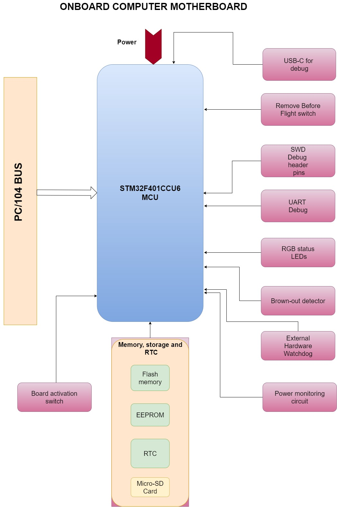
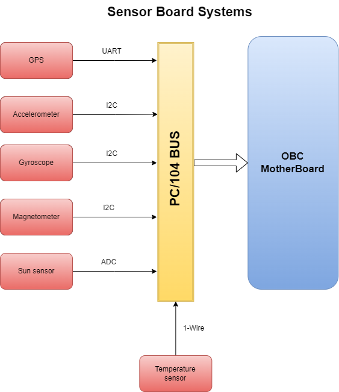
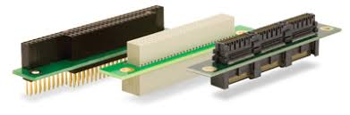
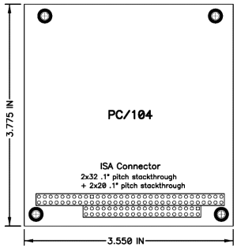
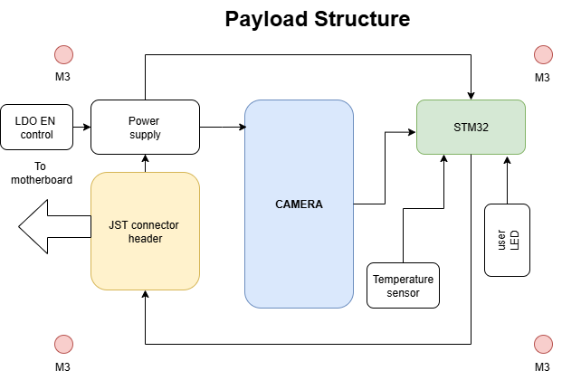
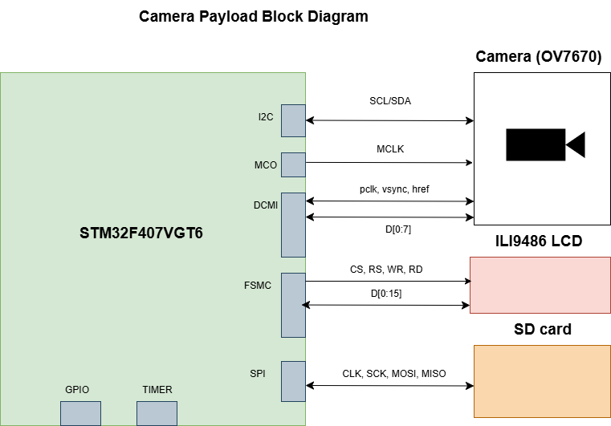
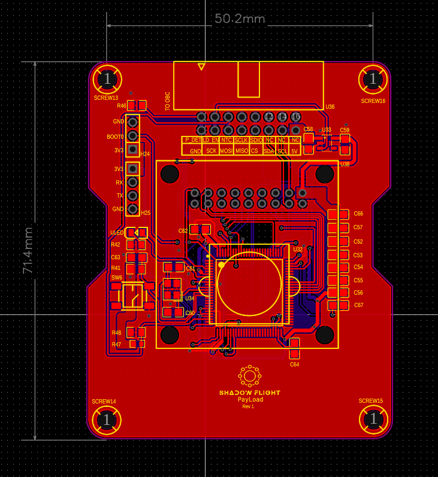
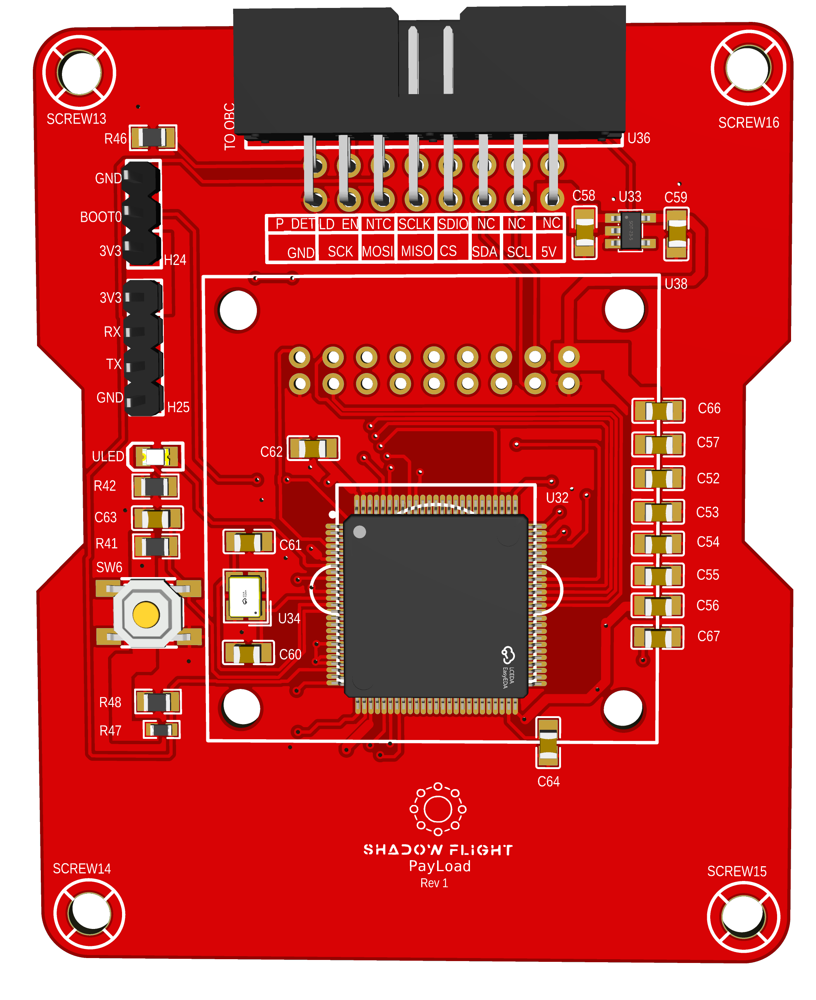

  <strong>🚧 In Development:</strong> This CubeSat project and its documentation are actively being developed. Expect frequent updates and changes.

# Project-Shadow-Flight
"Oh yee space fairer!
I will write your name on the moon with my fingertips"
~ ESA, EIRSAT-mission

**Project Creator:** Edwin Mwiti  
**Contact:** emwiti658@gmail.com  
**Github:** [bytecod3](https://github.com/bytecod3)

## Introduction
**Project-Shadow Flight** is a homemade 1U cubesat designed and built using FreeRTOS on STM32 framework 
and COTS components. None of these components are radiation hardened. 
The primary objective is technology demonstration of an Earth Observation cubesat built from the ground up. This cubesat has 
a VGA camera onboard to capture geo-referenced low-resolution earth imagery.

### Web documentation 
You can find a web friendly documentation format here: https://bytecod3.github.io/Project-Shadow-Flight/

### Design Videos for visual consumers
If you are more of a visual consumer, I have documented the whole design process in my Youtube channel playlist 
here: 
[Comprehensive Design videos](https://youtu.be/9HoKzI_bBjs?list=PLSQRKAY5h7mGCnkXsugdVSHa72dnC0zQU)

## Motivation
This project was motivated by the curiosity to learn about space systems, especially cubesats, 
mission softwares and space electronic hardware in general, and try to replicate, within 
a defined time-frame, a simple yet fully functional cubesat that can be used 
for demo purposes or even better, through the available channels, be improved for launch! 

## Mission statement
The primary mission for this cubesat is Earth Observation (EO). 
It is designed to operate in the Low Earth Orbit(LEO). It will capture images over
a given area, on a sun-synchronous subrecurrent orbit, depending on the received command from ground station. These images are then
compressed, stored and transmitted back to ground when a pass over a base station is reached. No image processing is 
done on board the Cubesate so as to save battery power and processing power for other critical tasks. 

The cubesat is designed to have two major operation modes:  
1. Normal operation mode
2. Mission operation mode 

These two states can be configured and changed accordingly from the ground station.

# System components 
A cubesat in general is made up of the following subsystems:  
1. Onboard Computer system (OBC)
2. Communication and Data Handling system (CD & H)
3. Electrical Power Supply system (EPS)
4. Attitude Determination and Control system (ADCS)
5. Sensor and Payload System 
6. Structural and Thermal system 

## 1. Onboard Computer 
### Introduction
The onboard computer performs the housekeeping tasks needed by the cubesat. It is the main link between all the other 
subsystems used in the cubesat.

### Functional requirements
The following is a list of the functional requirements of the OBC:

1. **The CubeSat shall perform reliable data processing and control operations using an STM32F401CCU6 microcontroller.**  
   This includes handling telemetry, command execution, subsystem coordination, and real-time control tasks.

2. **The CubeSat shall store mission-critical data and logs in non-volatile memory to prevent data loss during power cycles.**  
   Memory must support both temporary (RAM) and permanent (Flash or EEPROM) storage for payload data, telemetry, and system logs.

3. **The CubeSat shall support inter-board wired communication between the OBC, payload, and EPS using standard digital protocols (e.g., UART, I2C, SPI).**  
   The interfaces must support command, telemetry, and sensor data exchange.

4. **The CubeSat shall indicate system and subsystem statuses using onboard status LEDs.**  
   LED indicators shall reflect boot status, error conditions, power state, and communication activity for debugging and development.

5. **The CubeSat shall be programmable via an external programming/debugging header accessible during integration and testing.**  
   This header must support SWD or UART-based flashing and debugging.

6. **The CubeSat shall utilize deployment and "Remove Before Flight" (RBF) switches to ensure safe handling and automatic activation post-deployment.**  
   RBF switch shall disconnect power from the CubeSat until it is removed prior to launch. Deployment switches must detect separation from the deployer and initiate startup sequences.

7. **The CubeSat shall interface with the payload board via a standardized electrical connector to exchange power, control, and data signals.**  
   This interface must be robust to launch vibrations and support defined command/data protocols.

8. **The CubeSat shall monitor voltage and current levels of its power system using telemetry from the EPS.**  
   Power monitoring shall allow detection of over/under-voltage and overcurrent events to protect hardware.

9. **The CubeSat shall implement a brown-out detection mechanism to safely handle unexpected power drops.**  
   Upon voltage drop below a threshold, the MCU must reset safely or enter a low-power state to preserve system integrity.

10. **The CubeSat shall include a hardware watchdog timer to recover from software faults or unresponsive states.**  
    The watchdog must be periodically refreshed by software; failure to do so shall cause a system reset.

11. **The CubeSat shall include up to 3 inhibit switches in accordance with CubeSat deployment standards to prevent premature activation of systems.**  
    Inhibits must disable power or specific subsystems until conditions for deployment are met (e.g., separation from deployer).

12. **The CubeSat shall include a TRANSCEIVER which includes a Receiver , Transmitter , and Terminal Node Controller (TNC).**
    This will ensure telecommunication link between CubeSat and Ground Station.

### Components of the OBC
The OBC is made up of the following sub-systems:
- STM32F401CCU6 
- MEMORY AND Data storage
- Interboard Wired communication 
- Status LEDs
- Programming header
- Deployment switches
- Remove before flight switch
- Interfaces to Payload board
- Power monitoring system from EPS
- Brown-out detection circuit 
- Hardware watchdog timer 
- Inhibit switches 

The image below shows the memory and debug block diagram used on this cubesat's OBC:

  

**To note, all the PCBs are equipped with ISA PC/104 connectors to make stacking possible**

## 2. Sensor Board 
### Introduction 
The sensor board is responsible for housing the sensors used for environmental monitoring around the cubesat in space. The list of components 
used in this project's sensor board is as below: 

1. VGA Color Camera
2. Temperature sensor 
3. Humidity sensor
4. Pressure sensor 
5. Sun sensors 
6. Dedicated MCU 
7. Flash memory 
8. Dedicated Voltage regulator
9. Debug LEDs
10. ISA connector 
11. Watchdog Timer 
12. Inhibit switches
13. Remove before flight switch
14. GPS module

### Functional requirements 
1. **The sensor board shall measure ambient temperature using a digital temperature sensor.**  
   Temperature readings shall be provided periodically to the OBC via a digital interface (e.g., I²C or SPI).

2. **The sensor board shall measure relative humidity using a digital humidity sensor.**  
   Data shall be sampled at a configurable rate and stored or transmitted as telemetry.

3. **The sensor board shall measure ambient atmospheric pressure using a barometric pressure sensor.**  
   Pressure data shall support environmental diagnostics or payload experimentation.

4. **The sensor board shall include sun sensors to determine the direction and intensity of incident sunlight.**  
   Sensor data may be used to correlate with camera imagery or power system behavior.

7. **The sensor board shall operate using a dedicated low-power microcontroller (MCU) to manage data acquisition and communication.**  
   The MCU shall handle sensor polling and data formatting independent of the OBC

8. **The sensor board shall store acquired data in non-volatile Flash memory for later retrieval.**  
   Stored data shall persist through power cycles and include image frames and sensor telemetry.

9. **The sensor board shall regulate its internal power using a dedicated voltage regulator.**  
   The regulator shall provide stable 3.3V and/or 1.8V rails from the main CubeSat power bus.

10. **The sensor board shall interface with the CubeSat On-Board Computer (OBC) through an ISA connector.**  
   The interface shall support communication (e.g., I²C/SPI/UART), power, and synchronization signals.

11. **The sensor board shall include a hardware watchdog timer to reset the MCU in case of software lockup or failure.**  
    The watchdog shall require regular refresh signals; failure to refresh shall initiate an automatic system reset.

12. **The sensor board shall respond to Inhibit switches to disable or enable functionality based on the satellite’s deployment state.**  
    All active electronics must remain off until inhibit conditions are cleared.

13. **The sensor board shall remain unpowered until the Remove-Before-Flight (RBF) switch is removed.**  
    The board must detect the RBF switch state and delay power-up until it is safe to operate.

14. **The CubeSat shall include a GPS module to provide real-time position, velocity, and timing data.**  
The GPS module shall interface with the OBC via UART or another compatible digital protocol and provide NMEA or binary-format data for onboard logging, orbital tracking, and synchronization.

The block diagram is shown below:

### Communication protocol for sensors 
|   | Sensor             | Protocol |
|---|--------------------|----------|
| 1 | Temperature Sensor | 1-wire   |
| 2 | Accelerometer      | I2C      |
| 3 | Gyroscope          | I2C      |
| 4 | GPS                | UART     |
| 5 | Magnetometer       | I2C      |
| 6 | Sun sensor         | ADC      |

### The PC/104 ISA Bus
This project used the PC/104 standard for communication bus implementation. 

Bigest advantages of this standard:
- Stackable
- Interoperable- you can remove boards and use in another design
- Functionality extension - easy to add functionality
- Compact 
- Rugged - can handle shock and vibration 

An ISA connector looks like below:   

----

The images below explain the stacking of the PCB boards *(credit: Diamond Systems)*:  
  
----

  

----

Further reference: [PC-104 standard reference](https://www.diamondsystems.com/pc104)

### My Pin definition 
In order to customize the ISA connector to fit what this project uses, I have defined the pins as shown in this 
pin definition document. Since the project is in progress, these pin assignments are bound to change often:

<a href="https://docs.google.com/spreadsheets/d/11hD9y9vYMRVWSRXsNhsD9LqnLeL-uE_WEjQZ-0ekRwc/edit?usp=sharing" target="_blank">
    Shadow-Flight-PC/104 BUS
</a>

## 3. Attitude Determination and Control

  <strong>🚧 In Development</strong> 

This system is responsible for receiving attitude data from sensors and acting on it in realtime 
to control the attitude(orientation ) of the satellite.
This is mainly implemented in software as the diagram below depicts.

The signals produced are fed into ana actuator or tticde coontrol,

Data from the sensors is read, then passed to the ADCS algorithm.

## 4. Electrical Power System (EPS)

  <strong>🚧 In Development</strong> 

### Introduction
The EPS is responsible for the following functions:
    - Energy generation
    - Energy conversion
    - Power regulation
    - Power storage
    - Power distribution to loads

There are several methods to do power generation and other fucntions listed above. However, the recommended approach among most cubesat design teams, and the one I choose to follow for this project, is the procedure below:

    1. Define the power consumption and electrical characteristics of the spacecraft bus components 
    2. Define the necessary power generation and energy storage required 
    3. Select the power generation and energy storage methods 
    4. Analyse the system's power budget and profile based on the start to end of mission
    5. Design power conversion, management and distribution subsystem to interface the power sources 
    6. Procure and fabricate components 
    7. Conduct tests on isolated components 
    8. Conduct tests on integrated components 

There is a lot that can be discussed in respect to EPS but I have tried to be consise and to the point in the 
summaries below:

### a) Power consumption of different bus components 
### b) Power generation 
### c) Energy storage 
### d) Mission analysis in regards to power 
### e) EPS Schematics summary

#### Conversion
#### Power Distribution Schemes
#### Power supply control

### f) Isolated tests 
### g) EPS integration and Testing

#### Battery and solar panel sizing data 
During design, the selection criteria for the battery and solar panel is detailed in this spreadsheet: 
https://docs.google.com/spreadsheets/d/1j73pPU9ySfrlBch6TJMzdRGcuBdh9BN55jUy6Fb-AV4/edit?usp=sharing

# 5. Payload and Mission Design
The payload system of the cubesat is responsible for carrying out the primary mission objective. Everything else designed so far
is for the sole purpose of supporting the mission objective. 

Our primary payload is a color VGA camera, since this is an earth observation cubesat.

### Payload system requirements 
1. **Mission Objectives**
   - Capture low-resolution geo-referenced Earth imagery.  
   - Provide imaging capability to test CubeSat bus integration.  
   - Support technology demonstration of COTS payloads in orbit.  

2. **Imaging Requirements**
   - Resolution: **640 × 480 (VGA)**  
   - Color imaging in the **visible spectrum (RGB)**  
   - Still image capture mode (prioritized over video)  
   - Optical size: **1/6" sensor format**  
   - Angle of view: **~25°**  
   - Maximum frame rate: **30 fps @ VGA**  
   - Sensitivity: **1.3 V / (Lux·sec)**  
   - Signal-to-noise ratio: **46 dB**  
   - Dynamic range: **52 dB**  

3. **Data Handling Requirements**
   - Data acquisition via **parallel 8-bit bus (D0–D7)**  
   - Interface with OBC via **DMA**  
   - Lightweight **image compression** before storage and downlink  
   - Downlink data rate requirement: **< 100 kbps**  

4. **Electrical & Power Requirements**
   - Supply voltage: **2.5 – 3.3 V**  
   - Power consumption: **~60 mW (active)**  
   - Ability to **power off payload** to protect the bus  

5. **Mechanical & Thermal Requirements**
   - Mass and volume: **< 10 g, PCB-mounted**  
   - Mechanical interface: **Mounted on PCB, lens protrusion aligned with nadir face**  
   - Cooling: **Passive conduction only**  
   - Operating temperature: **-30 °C to +70 °C**  
   - Stable operation range: **0 °C to 50 °C**  

6. **Reliability & Limitations**
   - Payload is **COTS (not radiation hardened)**  
   - Expected degradation in LEO environment  
   - Payload can be **disabled via power control** in case of malfunction

The payload system is designed as a daughter-board mounted on the OBC via M3 screw connector with standoffs. 
The wired connection is made via a JST header pin. This header pin supplies the necessary power, control and communication signals to and from the Payload System. 

This simple block diagram is shown below:

### Payload communication interface
The image below shows the camera payload system designed using STM32F407VTG MCU that has a Digital Camera Interface (DCMI) solely dedicated for handling 
CMOS sensors such as the OV7670 camera module. This communication is done via 8 bit parallel interface, to receive video data. 

This MCU also has modes that allow us to to have either continous mode or snapshot mode to take still images.

The LCD shown in the above schematic will not be used on the actual satelite, but a connector is placed on teh payload PCB to help during 
ground testing and confirm the images we are taking. 

## Payload PCB 
The designed camera payload is shown below: 
#### Tracks 

#### 3D view

## Related documents
A list of related documents related to this project are provided below. They include diagrams, schematics,
design source files, datasheets, 2D diagrams, 3D assembly diagrams, test information and logs etc.

## Relevant videos and resource materials 
1. https://youtu.be/5voQfQOTem8 (Build your own satelite)
2. https://pressbooks-dev.oer.hawaii.edu/epet302/chapter/5-4-design-process-and-drivers/
3. https://resources.altium.com/p/prototyping-solar-solution-your-outdoor-embedded-device
4. https://pycubed.org/What%20is%20PyCubed%20f257a98ec60044538d8fbdc20fec987f.html
5. https://github.com/hsfl/artemis-hardware
6. https://sites.google.com/hawaii.edu/artemiscubesatkit

## Contribution and support
This project is not funded by any organization or entity and 
is solely reliant on out-of-pocket funding. 
We therefore heed to anyone desiring to contribute, 
in monetary form, technical advise, links and connections, 
electronic components, code and schematic design contribution, etc., or even if you are interested in knowing more 
about the project details,
 you can reach out to me via this email (emwiti658@gmail.com) 
 and I will get back to you soonest.  

 Thank you again for your consideration! Ad Astra!

## Contributors 
1. Edwin Mwiti
2. Augustine Gyan
3. Sebastian Muchui
