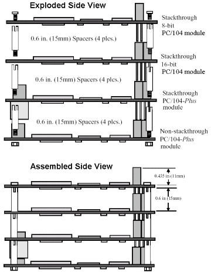

<div style="background-color:#fff3cd; border:1px solid #ffeeba; padding:10px; border-radius:5px;">
  <strong>🚧 In Development:</strong> This CubeSat project and its documentation are actively being developed. Expect frequent updates and changes.
</div>


<details open>
  <summary><h2> Table of Contents</h2></summary>

  <ul>
    <li><a href="#project-shadow-flight">Project-Shadow-Flight</a>
      <ul>
        <li><a href="#introduction">Introduction</a>
          <ul>
            <li><a href="#web-documentation">Web documentation</a></li>
            <li><a href="#design-videos-for-visual-consumers">Design Videos for visual consumers</a></li>
          </ul>
        </li>
        <li><a href="#motivation">Motivation</a></li>
        <li><a href="#mission-statement">Mission statement</a></li>
      </ul>
    </li>
    <li><a href="#system-components">System components</a>
      <ul>
        <li><a href="#1-onboard-computer">1. Onboard Computer</a>
          <ul>
            <li><a href="#introduction-1">Introduction</a></li>
            <li><a href="#functional-requirements">Functional requirements</a></li>
            <li><a href="#components-of-the-obc">Components of the OBC</a></li>
          </ul>
        </li>
        <li><a href="#2-sensor-board">2. Sensor Board</a>
          <ul>
            <li><a href="#introduction-2">Introduction</a></li>
            <li><a href="#functional-requirements-1">Functional requirements</a></li>
            <li><a href="#communication-protocol-for-sensors">Communication protocol for sensors</a></li>
            <li><a href="#the-pc104-isa-bus">The PC/104 ISA Bus</a></li>
            <li><a href="#my-pin-definition">My Pin definition</a></li>
          </ul>
        </li>
        <li><a href="#3-attitude-determination-and-control">3. Attitude Determination and Control</a></li>
        <li><a href="#4-electrical-power-system-eps">4. Electrical Power System (EPS)</a>
          <ul>
            <li><a href="#introduction-3">Introduction</a></li>
            <li><a href="#a-power-consumption-of-different-bus-components">a) Power consumption of different bus components</a></li>
            <li><a href="#b-power-generation">b) Power generation</a></li>
            <li><a href="#c-energy-storage">c) Energy storage</a></li>
            <li><a href="#d-mission-analysis-in-regards-to-power">d) Mission analysis in regards to power</a></li>
            <li><a href="#e-eps-schematics-summary">e) EPS Schematics summary</a>
              <ul>
                <li><a href="#conversion">Conversion</a></li>
                <li><a href="#power-distribution-schemes">Power Distribution Schemes</a></li>
                <li><a href="#power-supply-control">Power supply control</a></li>
              </ul>
            </li>
            <li><a href="#f-isolated-tests">f) Isolated tests</a></li>
            <li><a href="#g-eps-integration-and-testing">g) EPS integration and Testing</a>
              <ul>
                <li><a href="#battery-and-solar-panel-sizing-data">Battery and solar panel sizing data</a></li>
              </ul>
            </li>
          </ul>
        </li>
      </ul>
    </li>
    <li><a href="#5-payload-and-mission-design">5. Payload and Mission Design</a>
      <ul>
        <li><a href="#payload-system-requirements">Payload system requirements</a></li>
        <li><a href="#payload-communication-interface">Payload communication interface</a></li>
        <li><a href="#payload-pcb">Payload PCB</a>
          <ul>
            <li><a href="#tracks">Tracks</a></li>
            <li><a href="#3d-view">3D view</a></li>
          </ul>
        </li>
      </ul>
    </li>
    <li><a href="#communication-protocol">Communication Protocol</a>
      <ul>
        <li><a href="#ccsds-telemetrytm-space-data-link-protocol">CCSDS Telemetry(TM) Space Data Link Protocol</a>
          <ul>
            <li><a href="#what-is-ccsds-space-data-link-protocol">What is CCSDS Space Data Link Protocol</a></li>
            <li><a href="#ccsds-protocol-data-unit-pdu">CCSDS protocol data unit (PDU)</a></li>
            <li><a href="#field-descriptions">Field descriptions</a></li>
            <li><a href="#how-it-is-implemented">How it is implemented</a></li>
            <li><a href="#protocol-data-frame-pdu">Protocol data frame (PDU)</a>
              <ul>
                <li><a href="#1-primary-header">1. Primary header</a>
                  <ul>
                    <li><a href="#transfer-frame-version-number">Transfer Frame Version Number</a></li>
                    <li><a href="#spacecraft-identifier-scid">Spacecraft Identifier (SCID)</a></li>
                  </ul>
                </li>
                <li><a href="#ccsds-transfer-frame-header--virtual-channel-control-flag-and-counters">
                  CCSDS Transfer Frame Header – Virtual Channel, Control Flag, and Counters
                </a>
                  <ul>
                    <li><a href="#virtual-channel-identifier-vcid">Virtual Channel Identifier (VCID)</a></li>
                    <li><a href="#operational-control-field-flag-ocf-flag">Operational Control Field Flag (OCF Flag)</a></li>
                    <li><a href="#master-channel-frame-count-mcfc">Master Channel Frame Count (MCFC)</a></li>
                    <li><a href="#virtual-channel-frame-count-vcfc">Virtual Channel Frame Count (VCFC)</a></li>
                    <li><a href="#transfer-frame-data-field-status-tfdfs">Transfer Frame Data Field Status (TFDFS)</a></li>
                    <li><a href="#purpose">Purpose</a></li>
                  </ul>
                </li>
                <li><a href="#ccsds-transfer-frame-secondary-header">CCSDS Transfer Frame Secondary Header</a>
                  <ul>
                    <li><a href="#overview">Overview</a></li>
                    <li><a href="#structure">Structure</a></li>
                    <li><a href="#channel-association">Channel Association</a></li>
                    <li><a href="#usage-rules">Usage Rules</a></li>
                    <li><a href="#secondary-header-data-field-usage">Secondary header data field usage</a></li>
                  </ul>
                </li>
                <li><a href="#transfer-frame-data-field">Transfer Frame Data Field</a>
                  <ul>
                    <li><a href="#overview-1">Overview</a></li>
                    <li><a href="#field-length">Field Length</a></li>
                    <li><a href="#field-contents">Field Contents</a></li>
                    <li><a href="#channel-data-rules">Channel Data Rules</a></li>
                    <li><a href="#packet-placement">Packet Placement</a></li>
                  </ul>
                </li>
                <li><a href="#oid-only-idle-data-transfer-frames">OID (Only Idle Data) Transfer Frames</a>
                  <ul>
                    <li><a href="#oid-frame-rules">OID Frame Rules</a></li>
                    <li><a href="#lfsr-initialization">LFSR Initialization</a></li>
                    <li><a href="#vcid-association">VCID Association</a></li>
                    <li><a href="#notes">Notes</a></li>
                    <li><a href="#idle-data">Idle data</a></li>
                  </ul>
                </li>
                <li><a href="#frame-error-control-field-fecf">Frame Error Control Field (FECF)</a>
                  <ul>
                    <li><a href="#overview-2">Overview</a></li>
                    <li><a href="#encoding-procedure">Encoding Procedure</a></li>
                  </ul>
                </li>
              </ul>
            </li>
            <li><a href="#interface-with-the-ground-station">Interface with the ground station</a></li>
            <li><a href="#data-limits-and-known-issues">Data limits and known issues</a></li>
          </ul>
        </li>
      </ul>
    </li>
    <li><a href="#related-documents">Related documents</a></li>
    <li><a href="#relevant-videos-and-resource-materials">Relevant videos and resource materials</a></li>
    <li><a href="#contribution-and-support">Contribution and support</a></li>
    <li><a href="#contributors">Contributors</a></li>
  </ul>
</details>


<h1> <a href="#project-shadow-flight">Project-Shadow-Flight</a> </h1>
"Oh yee space fairer!
I will write your name on the moon with my fingertips"
~ ESA, EIRSAT-mission

**Project Creator:** Edwin Mwiti  
**Contact:** emwiti658@gmail.com  
**Github:** [bytecod3](https://github.com/bytecod3)


## Introduction
**Project-Shadow Flight** is a homemade 1U cubesat designed and built using FreeRTOS on STM32 framework 
and COTS components. None of these components are radiation hardened. 
The primary objective is technology demonstration of an Earth Observation cubesat built from the ground up. This cubesat has 
a VGA camera onboard to capture geo-referenced low-resolution earth imagery.

### Web documentation 
You can find a web friendly documentation format here: https://bytecod3.github.io/Project-Shadow-Flight/

### Design Videos for visual consumers
If you are more of a visual consumer, I have documented the whole design process in my Youtube channel playlist 
here: 
[Comprehensive Design videos](https://youtu.be/9HoKzI_bBjs?list=PLSQRKAY5h7mGCnkXsugdVSHa72dnC0zQU)


## Motivation
This project was motivated by the curiosity to learn about space systems, especially cubesats, 
mission softwares and space electronic hardware in general, and try to replicate, within 
a defined time-frame, a simple yet fully functional cubesat that can be used 
for demo purposes or even better, through the available channels, be improved for launch! 

## Mission statement
The primary mission for this cubesat is Earth Observation (EO). 
It is designed to operate in the Low Earth Orbit(LEO). It will capture images over
a given area, on a sun-synchronous subrecurrent orbit, depending on the received command from ground station. These images are then
compressed, stored and transmitted back to ground when a pass over a base station is reached. No image processing is 
done on board the Cubesate so as to save battery power and processing power for other critical tasks. 

The cubesat is designed to have two major operation modes:  
1. Normal operation mode
2. Mission operation mode 

These two states can be configured and changed accordingly from the ground station.

# System components 
A cubesat in general is made up of the following subsystems:  
1. Onboard Computer system (OBC)
2. Communication and Data Handling system (CD & H)
3. Electrical Power Supply system (EPS)
4. Attitude Determination and Control system (ADCS)
5. Sensor and Payload System 
6. Structural and Thermal system 

## 1. Onboard Computer 
### Introduction
The onboard computer performs the housekeeping tasks needed by the cubesat. It is the main link between all the other 
subsystems used in the cubesat.

### Functional requirements
The following is a list of the functional requirements of the OBC:


1. **The CubeSat shall perform reliable data processing and control operations using an STM32F401CCU6 microcontroller.**  
   This includes handling telemetry, command execution, subsystem coordination, and real-time control tasks.

2. **The CubeSat shall store mission-critical data and logs in non-volatile memory to prevent data loss during power cycles.**  
   Memory must support both temporary (RAM) and permanent (Flash or EEPROM) storage for payload data, telemetry, and system logs.

3. **The CubeSat shall support inter-board wired communication between the OBC, payload, and EPS using standard digital protocols (e.g., UART, I2C, SPI).**  
   The interfaces must support command, telemetry, and sensor data exchange.

4. **The CubeSat shall indicate system and subsystem statuses using onboard status LEDs.**  
   LED indicators shall reflect boot status, error conditions, power state, and communication activity for debugging and development.

5. **The CubeSat shall be programmable via an external programming/debugging header accessible during integration and testing.**  
   This header must support SWD or UART-based flashing and debugging.

6. **The CubeSat shall utilize deployment and "Remove Before Flight" (RBF) switches to ensure safe handling and automatic activation post-deployment.**  
   RBF switch shall disconnect power from the CubeSat until it is removed prior to launch. Deployment switches must detect separation from the deployer and initiate startup sequences.

7. **The CubeSat shall interface with the payload board via a standardized electrical connector to exchange power, control, and data signals.**  
   This interface must be robust to launch vibrations and support defined command/data protocols.

8. **The CubeSat shall monitor voltage and current levels of its power system using telemetry from the EPS.**  
   Power monitoring shall allow detection of over/under-voltage and overcurrent events to protect hardware.

9. **The CubeSat shall implement a brown-out detection mechanism to safely handle unexpected power drops.**  
   Upon voltage drop below a threshold, the MCU must reset safely or enter a low-power state to preserve system integrity.

10. **The CubeSat shall include a hardware watchdog timer to recover from software faults or unresponsive states.**  
    The watchdog must be periodically refreshed by software; failure to do so shall cause a system reset.

11. **The CubeSat shall include up to 3 inhibit switches in accordance with CubeSat deployment standards to prevent premature activation of systems.**  
    Inhibits must disable power or specific subsystems until conditions for deployment are met (e.g., separation from deployer).

12. **The CubeSat shall include a TRANSCEIVER which includes a Receiver , Transmitter , and Terminal Node Controller (TNC).**
    This will ensure telecommunication link between CubeSat and Ground Station.

### Components of the OBC
The OBC is made up of the following sub-systems:
- STM32F401CCU6 
- MEMORY AND Data storage
- Interboard Wired communication 
- Status LEDs
- Programming header
- Deployment switches
- Remove before flight switch
- Interfaces to Payload board
- Power monitoring system from EPS
- Brown-out detection circuit 
- Hardware watchdog timer 
- Inhibit switches 

The image below shows the memory and debug block diagram used on this cubesat's OBC:


  

**To note, all the PCBs are equipped with ISA PC/104 connectors to make stacking possible**


## 2. Sensor Board 
### Introduction 
The sensor board is responsible for housing the sensors used for environmental monitoring around the cubesat in space. The list of components 
used in this project's sensor board is as below: 

1. VGA Color Camera
2. Temperature sensor 
3. Humidity sensor
4. Pressure sensor 
5. Sun sensors 
6. Dedicated MCU 
7. Flash memory 
8. Dedicated Voltage regulator
9. Debug LEDs
10. ISA connector 
11. Watchdog Timer 
12. Inhibit switches
13. Remove before flight switch
14. GPS module

### Functional requirements 
1. **The sensor board shall measure ambient temperature using a digital temperature sensor.**  
   Temperature readings shall be provided periodically to the OBC via a digital interface (e.g., I²C or SPI).

2. **The sensor board shall measure relative humidity using a digital humidity sensor.**  
   Data shall be sampled at a configurable rate and stored or transmitted as telemetry.

3. **The sensor board shall measure ambient atmospheric pressure using a barometric pressure sensor.**  
   Pressure data shall support environmental diagnostics or payload experimentation.

4. **The sensor board shall include sun sensors to determine the direction and intensity of incident sunlight.**  
   Sensor data may be used to correlate with camera imagery or power system behavior.

7. **The sensor board shall operate using a dedicated low-power microcontroller (MCU) to manage data acquisition and communication.**  
   The MCU shall handle sensor polling and data formatting independent of the OBC

8. **The sensor board shall store acquired data in non-volatile Flash memory for later retrieval.**  
   Stored data shall persist through power cycles and include image frames and sensor telemetry.

9. **The sensor board shall regulate its internal power using a dedicated voltage regulator.**  
   The regulator shall provide stable 3.3V and/or 1.8V rails from the main CubeSat power bus.

10. **The sensor board shall interface with the CubeSat On-Board Computer (OBC) through an ISA connector.**  
   The interface shall support communication (e.g., I²C/SPI/UART), power, and synchronization signals.

11. **The sensor board shall include a hardware watchdog timer to reset the MCU in case of software lockup or failure.**  
    The watchdog shall require regular refresh signals; failure to refresh shall initiate an automatic system reset.

12. **The sensor board shall respond to Inhibit switches to disable or enable functionality based on the satellite’s deployment state.**  
    All active electronics must remain off until inhibit conditions are cleared.

13. **The sensor board shall remain unpowered until the Remove-Before-Flight (RBF) switch is removed.**  
    The board must detect the RBF switch state and delay power-up until it is safe to operate.

14. **The CubeSat shall include a GPS module to provide real-time position, velocity, and timing data.**  
The GPS module shall interface with the OBC via UART or another compatible digital protocol and provide NMEA or binary-format data for onboard logging, orbital tracking, and synchronization.

The block diagram is shown below:


### Communication protocol for sensors 
|   | Sensor             | Protocol |
|---|--------------------|----------|
| 1 | Temperature Sensor | 1-wire   |
| 2 | Accelerometer      | I2C      |
| 3 | Gyroscope          | I2C      |
| 4 | GPS                | UART     |
| 5 | Magnetometer       | I2C      |
| 6 | Sun sensor         | ADC      |

### The PC/104 ISA Bus
This project used the PC/104 standard for communication bus implementation. 

Bigest advantages of this standard:
- Stackable
- Interoperable- you can remove boards and use in another design
- Functionality extension - easy to add functionality
- Compact 
- Rugged - can handle shock and vibration 

An ISA connector looks like below:   


----

The images below explain the stacking of the PCB boards *(credit: Diamond Systems)*:  
  
----

  

----

Further reference: [PC-104 standard reference](https://www.diamondsystems.com/pc104)

### My Pin definition 
In order to customize the ISA connector to fit what this project uses, I have defined the pins as shown in this 
pin definition document. Since the project is in progress, these pin assignments are bound to change often:

<a href="https://docs.google.com/spreadsheets/d/11hD9y9vYMRVWSRXsNhsD9LqnLeL-uE_WEjQZ-0ekRwc/edit?usp=sharing" target="_blank">
    Shadow-Flight-PC/104 BUS
</a>


## 3. Attitude Determination and Control
<div style="background-color:#fff3cd; border:1px solid #ffeeba; padding:10px; border-radius:5px;">
  <strong>🚧 In Development</strong> 
</div>
This system is responsible for receiving attitude data from sensors and acting on it in realtime 
to control the attitude(orientation ) of the satellite.
This is mainly implemented in software as the diagram below depicts.

The signals produced are fed into ana actuator or tticde coontrol,

Data from the sensors is read, then passed to the ADCS algorithm.


## 4. Electrical Power System (EPS)
<div style="background-color:#fff3cd; border:1px solid #ffeeba; padding:10px; border-radius:5px;">
  <strong>🚧 In Development</strong> 
</div>
### Introduction
The EPS is responsible for the following functions:
    - Energy generation
    - Energy conversion
    - Power regulation
    - Power storage
    - Power distribution to loads

There are several methods to do power generation and other fucntions listed above. However, the recommended approach among most cubesat design teams, and the one I choose to follow for this project, is the procedure below:

    1. Define the power consumption and electrical characteristics of the spacecraft bus components 
    2. Define the necessary power generation and energy storage required 
    3. Select the power generation and energy storage methods 
    4. Analyse the system's power budget and profile based on the start to end of mission
    5. Design power conversion, management and distribution subsystem to interface the power sources 
    6. Procure and fabricate components 
    7. Conduct tests on isolated components 
    8. Conduct tests on integrated components 

There is a lot that can be discussed in respect to EPS but I have tried to be consise and to the point in the 
summaries below:

### a) Power consumption of different bus components 
### b) Power generation 
### c) Energy storage 
### d) Mission analysis in regards to power 
### e) EPS Schematics summary

#### Conversion
#### Power Distribution Schemes
#### Power supply control

### f) Isolated tests 
### g) EPS integration and Testing

#### Battery and solar panel sizing data 
During design, the selection criteria for the battery and solar panel is detailed in this spreadsheet: 
https://docs.google.com/spreadsheets/d/1j73pPU9ySfrlBch6TJMzdRGcuBdh9BN55jUy6Fb-AV4/edit?usp=sharing


# 5. Payload and Mission Design
The payload system of the cubesat is responsible for carrying out the primary mission objective. Everything else designed so far
is for the sole purpose of supporting the mission objective. 

Our primary payload is a color VGA camera, since this is an earth observation cubesat.

### Payload system requirements 
1. **Mission Objectives**
   - Capture low-resolution geo-referenced Earth imagery.  
   - Provide imaging capability to test CubeSat bus integration.  
   - Support technology demonstration of COTS payloads in orbit.  

2. **Imaging Requirements**
   - Resolution: **640 × 480 (VGA)**  
   - Color imaging in the **visible spectrum (RGB)**  
   - Still image capture mode (prioritized over video)  
   - Optical size: **1/6" sensor format**  
   - Angle of view: **~25°**  
   - Maximum frame rate: **30 fps @ VGA**  
   - Sensitivity: **1.3 V / (Lux·sec)**  
   - Signal-to-noise ratio: **46 dB**  
   - Dynamic range: **52 dB**  

3. **Data Handling Requirements**
   - Data acquisition via **parallel 8-bit bus (D0–D7)**  
   - Interface with OBC via **DMA**  
   - Lightweight **image compression** before storage and downlink  
   - Downlink data rate requirement: **< 100 kbps**  

4. **Electrical & Power Requirements**
   - Supply voltage: **2.5 – 3.3 V**  
   - Power consumption: **~60 mW (active)**  
   - Ability to **power off payload** to protect the bus  

5. **Mechanical & Thermal Requirements**
   - Mass and volume: **< 10 g, PCB-mounted**  
   - Mechanical interface: **Mounted on PCB, lens protrusion aligned with nadir face**  
   - Cooling: **Passive conduction only**  
   - Operating temperature: **-30 °C to +70 °C**  
   - Stable operation range: **0 °C to 50 °C**  

6. **Reliability & Limitations**
   - Payload is **COTS (not radiation hardened)**  
   - Expected degradation in LEO environment  
   - Payload can be **disabled via power control** in case of malfunction

The payload system is designed as a daughter-board mounted on the OBC via M3 screw connector with standoffs. 
The wired connection is made via a JST header pin. This header pin supplies the necessary power, control and communication signals to and from the Payload System. 

This simple block diagram is shown below:


### Payload communication interface
The image below shows the camera payload system designed using STM32F407VTG MCU that has a Digital Camera Interface (DCMI) solely dedicated for handling 
CMOS sensors such as the OV7670 camera module. This communication is done via 8 bit parallel interface, to receive video data. 

This MCU also has modes that allow us to to have either continous mode or snapshot mode to take still images.


The LCD shown in the above schematic will not be used on the actual satelite, but a connector is placed on teh payload PCB to help during 
ground testing and confirm the images we are taking. 

## Payload PCB 
The designed camera payload is shown below: 
#### Tracks 


#### 3D view


# Communication Protocol
## CCSDS Telemetry(TM) Space Data Link Protocol 
This cubesat used a slightly modified version of the CCSDS space data link protocol for telemetry transmission. This section will introduce what it is and describe how this protocol is used for the cubesat. 

### What is CCSDS Space Data Link Protocol
The CCSDS Space Data Link Protocol defines how data is packaged and transmitted between a CubeSat and its ground station. It specifies the structure of Transfer Frames: standardized data units that carry telemetry, science data, and control information over the radio link. By following CCSDS, CubeSats use the same reliable communication principles as larger spacecraft, ensuring data integrity, synchronization, and compatibility with ground systems used by space agencies and universities. In practice, this protocol governs how the CubeSat’s onboard computer organizes data before sending it to Earth, and how the ground station interprets and validates that data upon reception.


### CCSDS protocol data unit (PDU)
The image below shows an illustration of the CCSDS space data link protocol with the field names and field sizes as described in the CCSDS standard.


### Field descriptions 
The following table contains the field descriptions of the CCSDS PDU. 

### How it is implemented
For more information on the specific implemetation, please refer to the following 2 files ```ccsds_tm.h``` and ```ccsds_tm.c``` in the ```Inc``` and ```Src``` folders of ```\firmware\OBC``` folder respectively. 

Additionaly, there is a full video below that describes how this protocol was implemented from scratch. 
This protocol is implemented without the SDLS (Space Data Link Security) feature, which will be implemented later. 
This section describes what each field stands for and how it is used in comms for this cubesat:

### Protocol data frame (PDU)
A telemetry data frame contains the following: 


| Field Name                    | Size (Bytes) | Optional | Description |
|-------------------------------|---------------|-----------|--------------|
| **Primary Header**            | 6             | No        | Contains key identification fields such as version, spacecraft ID, virtual channel ID, and frame count. |
| **Secondary Header**          | Up to 64      | Yes       | Mission-defined field used for additional information (e.g., timestamps, mode, source ID). |
| **Data Field**                | *n*           | No        | Contains the actual user or telemetry data payload. |
| **Operational Control Field** | 4             | Yes       | Used for onboard control functions (e.g., synchronization or sequence control). |
| **Frame Error Control Field** | 2             | Yes       | Holds the CRC or checksum for error detection. |

---

#### 1. Primary header 

| Field Name                        | Size           | Mandatory | Description |
|----------------------------------|----------------|------------|--------------|
| **Master Channel Identifier**     | 12 bits (1.5 bytes) | Yes | Identifies the master channel through which the frame is transmitted. |
| **Virtual Channel Identifier**    | 3 bits         | Yes | Identifies the virtual channel within the master channel. |
| **Operational Control Field Flag**| 1 bit          | Yes | Indicates whether the optional Operational Control Field is present. |
| **Master Channel Frame Count**    | 1 octet (8 bits) | Yes | Running count of frames sent on this master channel. |
| **Virtual Channel Frame Count**   | 1 octet (8 bits) | Yes | Running count of frames sent on this virtual channel. |
| **Transfer Frame Data Field Status** | 2 octets (16 bits) | Yes | Provides status information related to the data field (e.g., synchronization, packet order). |


#### Transfer Frame Version Number
- Bits **0–1** of the Transfer Frame Primary Header represent the **Transfer Frame Version Number**.  
- This field identifies the type of transfer frame being used.  
- For the standard CCSDS Telemetry (TM) frame, this value is always **`00` (binary)**.  
- Although Telemetry (TM) and Telecommand (TC) frames share the same version number, they can still be distinguished by their **Attached Sync Marker** or **Start Sequence** at the physical layer.

#### Spacecraft Identifier (SCID)
- Bits **2–11** of the Primary Header contain the **Spacecraft Identifier (SCID)**.  
- This 10-bit value uniquely identifies the spacecraft that generated the frame.  
- The SCID remains **constant throughout all mission phases**.  
- Spacecraft Identifiers are assigned by the **Space Assigned Numbers Authority (SANA)** to prevent duplicates within the same frequency band.  
- The same SCID value may be reused by another spacecraft operating in a **different frequency band**.

For this cubesat, I will use a self-assigned SCID. 


### CCSDS Transfer Frame Header – Virtual Channel, Control Flag, and Counters

#### Virtual Channel Identifier (VCID)
- The **Virtual Channel Identifier** specifies which Virtual Channel the frame belongs to.  
- There are **no restrictions** on how Virtual Channel Identifiers are assigned.  
- Virtual Channels do **not** need to be numbered consecutively.  
- Each Virtual Channel allows data from different onboard sources (e.g., OBC, ADCS, Payload) to be multiplexed over the same Master Channel.

#### Operational Control Field Flag (OCF Flag)
- **Bit 15** of the Transfer Frame Primary Header contains the **Operational Control Field Flag**.  
- This flag indicates whether the **Operational Control Field** is included in the frame.  
  - `1` → Operational Control Field **present**  
  - `0` → Operational Control Field **not present**  
- The OCF Flag remains **constant** within a given Master or Virtual Channel for the duration of a mission phase.

#### Master Channel Frame Count (MCFC)
- **Bits 16–23** of the Primary Header hold the **Master Channel Frame Count**.  
- This is an **8-bit sequential counter (modulo-256)** that increments for every frame transmitted on a specific Master Channel.  
- The counter should **not be reset** before reaching 255, except when absolutely necessary (e.g., after a system reset).  
- The MCFC helps detect **missing or out-of-sequence frames** within a Master Channel.  
- If the counter is reset unexpectedly, continuity of the frame sequence cannot be guaranteed.

#### Virtual Channel Frame Count (VCFC)
- **Bits 24–31** of the Primary Header hold the **Virtual Channel Frame Count**.  
- This is also an **8-bit sequential counter (modulo-256)** that increments for each frame sent within a specific Virtual Channel.  
- The VCFC allows the receiver to check for missing or reordered frames within the same Virtual Channel.


#### Transfer Frame Data Field Status (TFDFS)
- **Bits 32–47** of the Transfer Frame Primary Header contain the **Transfer Frame Data Field Status** field.  
- This field provides status information about the data contained in the frame and the structure of the Data Field.  
- It helps the receiving system correctly interpret and process the contents of the frame.

The specific meaning of the bits within the TFDFS depends on the **mission configuration** and whether **Virtual Channels** and **Packet Telemetry** are being used.  
Typical subfields include the following:

| Subfield | Size | Description |
|-----------|------|-------------|
| **Transfer Frame Secondary Header Flag**| 1 bit| Indicates whether a **Secondary Header** is included in the frame. `1` the receiver expects a secondary header, `0` data field follows immediately after primary header  |
| **Synchronization Flag** | 1 bit | Indicates whether the first data bit of a packet starts in this frame (`1` = yes, `0` = no). |
| **Packet Order Flag** | 1 bit | Indicates if packets are delivered in order within the Virtual Channel. |
| **Segment Length ID** | 2 bits | Defines how packet segments are divided among frames (e.g., continuation, start, or end of a packet). |
| **First Header Pointer** | 11 bits | Points to the start of the first packet header within the data field (measured in bytes). A special value (e.g., `2047` or `0x7FF`) may indicate that no packet header starts in this frame. |
| **Reserved / Spare** | Remaining bits | Reserved for future use; typically set to zero. |

#### Purpose
- Provides the **receiver** with context for reconstructing packets from multiple transfer frames.  
- Enables detection of packet boundaries and handling of partial or fragmented packets.  
- Ensures that higher-level telemetry processing software (e.g., the ground segment) can reassemble CCSDS packets accurately, even when frames arrive out of order or with gaps.


### CCSDS Transfer Frame Secondary Header

#### Overview
The **Transfer Frame Secondary Header** is **optional**, and its **presence or absence** is indicated by the **Transfer Frame Secondary Header Flag** in the **Primary Header** (see Section 4.1.2.7.2).

#### Structure
If present, the Secondary Header shall consist of an **integral number of octets** organized as follows:

| Field | Size | Requirement | Description |
|--------|------|--------------|--------------|
| **Transfer Frame Secondary Header Identification Field** | 1 octet | Mandatory | Identifies the type or purpose of the Secondary Header. |
| **Transfer Frame Secondary Header Data Field** | 1–63 octets | Mandatory | Contains additional header data defined by the mission or application. |

#### Channel Association
- The **Secondary Header** shall be associated with **either** a **Master Channel** or a **Virtual Channel**.  
- This association determines the synchronization behavior of the data within that channel.

> **Note:**  
> - Association with a **Master Channel** allows data transfer synchronized with that Master Channel.  
> - Association with a **Virtual Channel** allows data transfer synchronized with that Virtual Channel.

#### Usage Rules
- If present, the Secondary Header must appear in **every Transfer Frame** transmitted through the associated **Master** or **Virtual Channel** during a **Mission Phase**.  
- The structure and meaning of the Secondary Header contents are typically **mission-specific** and defined by higher-level standards or user design.


#### Secondary header data field usage 
For synchronization, I pack the following data into the secondary header:  
```TBD```

### Transfer Frame Data Field

#### Overview
The **Transfer Frame Data Field** immediately follows the **Primary Header** or, if present, the **Secondary Header**, without any gap.

#### Field Length
The **Transfer Frame Data Field** has a **variable length** (an integer number of octets) determined by:

> **Length of Data Field =**  
> (Fixed Transfer Frame Length for the Physical Channel)  
> − (Length of Primary Header + Length of Secondary Header + Length of Trailer if present)

#### Field Contents
The **Transfer Frame Data Field** shall contain one of the following:
- **Packets**
- **One Virtual Channel Access Service Data Unit (VCA_SDU)**
- **Idle Data**

#### Channel Data Rules
- A **Virtual Channel** shall **not** mix **Packets** and **VCA_SDUs**.  
- **Idle Data** may be transmitted on a Virtual Channel that carries **Packets**.  
- The type of data (Packets or VCA_SDUs) for a given Virtual Channel is **defined by management** and remains **static throughout a Mission Phase**.

#### Packet Placement
When **Packets** are contained in the Data Field:
- They shall be **inserted contiguously** and in **forward order**.
- The **first and last Packets** in a frame may be **incomplete**, since:
  - The first Packet may continue from the **previous Transfer Frame**.
  - The last Packet may continue into the **next Transfer Frame** of the same Virtual Channel.

> **Note:** This behavior supports segmentation of large data packets across multiple frames.

---

### OID (Only Idle Data) Transfer Frames

If insufficient data (Packets or VCA_SDUs) are available when a frame is ready for transmission, a **Transfer Frame containing only Idle Data** is sent.  
Such a frame is called an **OID Transfer Frame**.

#### OID Frame Rules
- The **First Header Pointer** shall be set to `11111111110`.  
- The **Data Field** shall be filled using a **Pseudo Noise (PN)** sequence generated by a **32-cell Linear Feedback Shift Register (LFSR)** with the polynomial:

> **Polynomial:**  
> D⁰ + D¹ + D² + D²² + D³²

#### LFSR Initialization

| LFSR Type | Initialization Seed | Notes |
|------------|--------------------|--------|
| **Fibonacci form** | All-ones seed | Initialized once at device start-up and not restarted. |
| **Galois form** | `00000000001111111111111111111101` | Initialized once at device start-up and not restarted. |

> **Example:**  
> The first 10 bytes of the OID data pattern (hexadecimal):  
> `FF FF FF FF 6D B6 D8 61 45 1F`

#### VCID Association
The **VCID** (Virtual Channel Identifier) of an **OID Transfer Frame** shall correspond to one of the VCIDs used for transmitting **Packets**.

#### Notes
1. The **Data Field** of an OID frame contains only **Idle Data**, but the **Secondary Header** or **Operational Control Field** may still carry valid data depending on the Virtual Channel.  
2. Although OID frames may be sent on Virtual Channels that also carry valid packets, it is **preferred** to dedicate a **separate Virtual Channel** for them, unless specific channel usage is required.  
3. An OID Transfer Frame may be generated **at any time**, even during transmission of a multi-frame packet.  
4. OID Data in the Data Field should **not** be confused with the **Idle Packet** defined in reference [8].  
5. A random PN sequence ensures sufficient **bit randomness** to prevent **frame-reception issues** caused by repetitive patterns.


#### Idle data
OID (ony idle data), transfer frame is a placeholder transmitted when the spacecraft must keep sending frames at a fixed rate but there are no real data packets to be sent at that time, so instead of stopping transmission or leaving channel idle, the system sends an OID frame filled with pseudo-random data (idle data).

Analogous to heartbeat packets to jeep the system link alive and synchronized until data is ready. 

For this cubesat, this is rarely achieved because the data rate designed is fixed, and based on the architecture used in this cubesat, it is always guaranteed to have data avaliable in the telemetry packet by the time data transmission is reached.

### Frame Error Control Field (FECF)

#### Overview
The **Frame Error Control Field (FECF)** is a **16-bit (2-byte)** optional field appended to the **end of a Transfer Frame**.  
It is used to **detect transmission errors** by applying a **Cyclic Redundancy Check (CRC)** algorithm over the frame data.

---

#### Encoding Procedure
The FECF is generated using a **CRC-16** procedure. The encoding process works as follows:

1. Take the complete **Transfer Frame**, **excluding** the FECF itself — this portion is `(n−16)` bits long.  
2. Compute a **16-bit CRC** across that data.  
3. Append the resulting **16-bit CRC value** to the **end of the Transfer Frame**.

This produces a **systematic binary block code** of total length `n` bits, where:

For project shadow flight, I make this field mandatory so as to detect anytransmission errors in every data frame.

### Interface with the ground station 

### Data limits and known issues


## Related documents
A list of related documents related to this project are provided below. They include diagrams, schematics,
design source files, datasheets, 2D diagrams, 3D assembly diagrams, test information and logs etc.

## Relevant videos and resource materials 
1. https://youtu.be/5voQfQOTem8 (Build your own satelite)
2. https://pressbooks-dev.oer.hawaii.edu/epet302/chapter/5-4-design-process-and-drivers/
3. https://resources.altium.com/p/prototyping-solar-solution-your-outdoor-embedded-device
4. https://pycubed.org/What%20is%20PyCubed%20f257a98ec60044538d8fbdc20fec987f.html
5. https://github.com/hsfl/artemis-hardware
6. https://sites.google.com/hawaii.edu/artemiscubesatkit
7. https://pressbooks-dev.oer.hawaii.edu/epet302/chapter/typical-software/

## Contribution and support
This project is not funded by any organization or entity and 
is solely reliant on out-of-pocket funding. 
We therefore heed to anyone desiring to contribute, 
in monetary form, technical advise, links and connections, 
electronic components, code and schematic design contribution, etc., or even if you are interested in knowing more 
about the project details,
 you can reach out to me via this email (emwiti658@gmail.com) 
 and I will get back to you soonest.  

 Thank you again for your consideration! Ad Astra!

## Contributors 
1. Edwin Mwiti
2. Augustine Gyan [](https://github.com/augustinegyan)
3. Sebastian Muchui [](https://github.com/astianmuchui)
